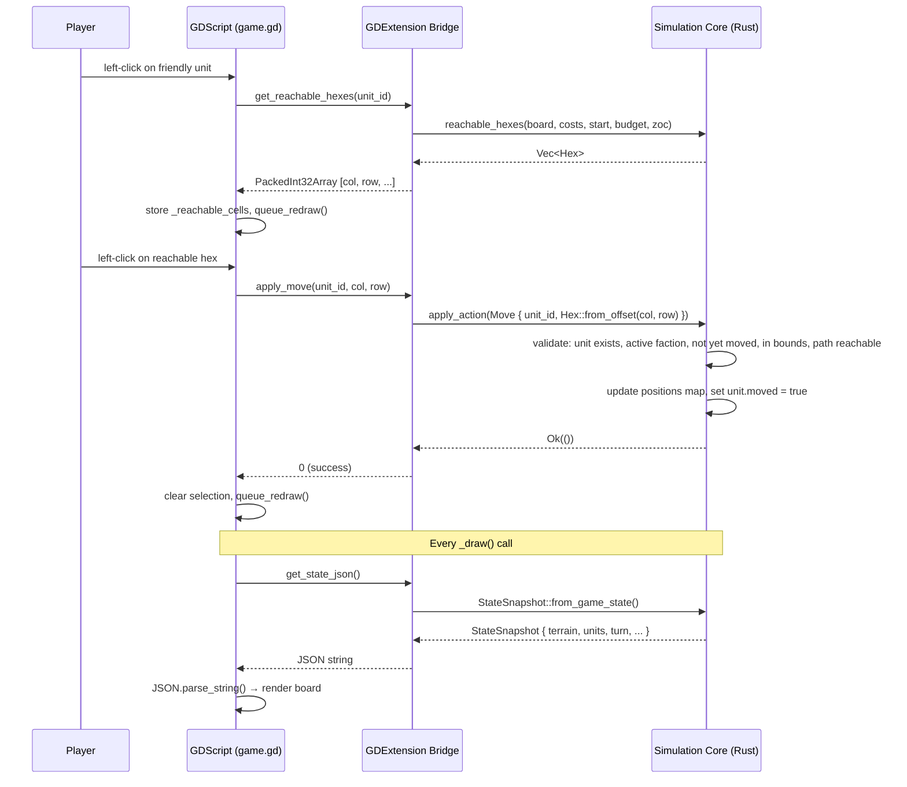
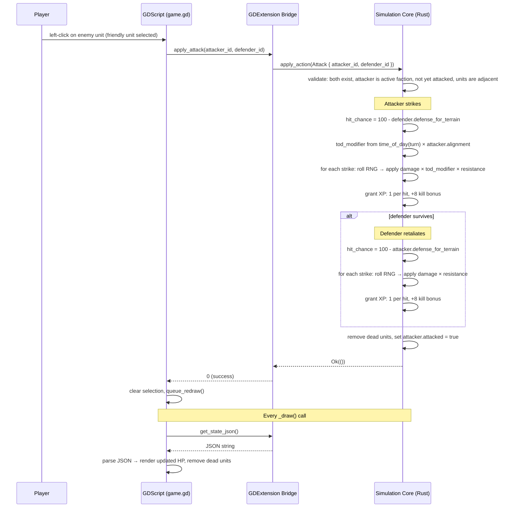

# NorRust Architecture

NorRust is built on a strict separation of concerns: the headless simulation core owns all game rules, while the presentation layer handles visuals and input. This means game logic can be tested without Redot, and external AI agents interact via the same interface as the human player.

## System Overview

```mermaid
graph TD
    subgraph Presentation Layer ["Presentation Layer (Redot / GDScript)"]
        UI[User Interface / HUD]
        Input[Player Input Handling]
        Renderer[Hex Grid & Unit Renderer]
        ClientAI[GDScript AI Trigger]
    end

    subgraph Integration Bridge ["GDExtension Bridge (C API)"]
        Bridge[Rust ↔ GDScript Bridge]
        JSON_State[StateSnapshot (JSON)]
        JSON_Action[ActionRequest (JSON)]
    end

    subgraph Simulation Core ["Simulation Core (Rust - Headless)"]
        State[GameState & Board]
        Logic[Game Rules & Combat Math]
        Pathfinding[A* & Reachability]
        InternalAI[Analytic AI Planner]
    end

    subgraph Data Layer ["Data Layer (Disk)"]
        TOML_Units[(Unit Definitions .toml)]
        TOML_Terrain[(Terrain Definitions .toml)]
    end

    subgraph External ["External Clients (Future)"]
        Ext_AI[Python / RL Agents]
    end

    %% Flow of control and data
    Input -->|Events| Bridge
    ClientAI -->|Triggers| Bridge
    UI -->|Queries| Bridge
    Renderer -->|Queries| Bridge

    Bridge <-->|Parses / Serializes| JSON_State
    Bridge <-->|Dispatches| JSON_Action

    JSON_Action -->|Mutates| State
    JSON_State <--|Reads| State

    Logic --> State
    Pathfinding --> State
    InternalAI --> State

    TOML_Units -->|Loads on Startup| Bridge
    TOML_Terrain -->|Loads on Startup| Bridge

    Ext_AI -.->|Socket/TCP| JSON_Action
    Ext_AI -.->|Socket/TCP| JSON_State
```

## Key Architectural Patterns

1. **Strictly One-Way Data Flow:**
   `Input -> Bridge -> apply_action() -> Mutate State -> JSON Snapshot -> Render`
2. **"Fail-Fast" Action Validation:**
   Actions submitted to the core are validated before execution. If an action is illegal (e.g., moving too far, attacking out of range), the core returns an `ActionError` and the state remains pristine.
3. **Headless-First Testing:**
   Because the core is independent of Redot, complex scenarios (like a 5v5 AI battle taking 100 turns) can be simulated and verified in milliseconds via standard `cargo test`.

---

## Directory Structure

```
norrust/
├── norrust_core/           # Rust simulation core (cdylib + rlib)
│   ├── src/
│   │   ├── lib.rs          # Module declarations
│   │   ├── board.rs        # Board, Tile structs
│   │   ├── game_state.rs   # GameState, apply_action(), Action, ActionError
│   │   ├── hex.rs          # Hex coordinate type (cubic + odd-r offset)
│   │   ├── unit.rs         # Unit, advance_unit(), parse_alignment()
│   │   ├── combat.rs       # Combat resolution, time_of_day()
│   │   ├── pathfinding.rs  # reachable_hexes(), A*, ZOC
│   │   ├── ai.rs           # ai_take_turn() greedy planner
│   │   ├── mapgen.rs       # generate_map() procedural terrain generator
│   │   ├── schema.rs       # UnitDef, TerrainDef, AttackDef (serde)
│   │   ├── loader.rs       # Registry<T>, load_from_dir()
│   │   ├── snapshot.rs     # StateSnapshot, TileSnapshot, ActionRequest (JSON)
│   │   └── gdext_node.rs   # NorRustCore GDExtension class (bridge)
│   └── tests/
│       └── simulation.rs   # Integration tests (headless)
├── norrust_client/         # Redot project (GDScript frontend)
│   ├── scripts/
│   │   └── game.gd         # Main scene script
│   └── bin/                # Compiled .so placed here for Redot to load
├── data/
│   ├── units/              # 322 unit TOML files (4 custom + 318 Wesnoth)
│   └── terrain/            # 14 terrain TOML files
└── tools/
    └── scrape_wesnoth.py   # WML → TOML scraper (stdlib only)
```

---

## Component Details

### 1. Presentation Layer (Redot / GDScript)
The frontend (`norrust_client`) is entirely responsible for visuals and capturing player intent. It knows *nothing* about game rules, unit stats, or hex math.
- **Responsibilities:** Rendering the hex grid, drawing unit circles with HP text, handling mouse clicks, and managing the UI HUD.
- **State Management:** The client holds no authoritative state. Every frame, it calls `get_state_json()` to receive a fresh `StateSnapshot` and renders from that data alone.
- **Action Dispatch:** When a player clicks to move or attack, the client does not execute the action. It calls a typed bridge method (`apply_move`, `apply_attack`, `end_turn`) and the Rust core decides whether it is legal.

### 2. Integration Bridge (GDExtension & JSON)
The boundary between Redot (C++) and Rust. This layer translates GDScript calls into type-safe Rust execution.
- **JSON State Serialization:** The Rust core exports the full board and unit state as a JSON string (`StateSnapshot`). This lets both GDScript and future external clients read state without complex object bindings.
- **Action Routing:** GDScript calls typed bridge methods (e.g., `apply_move(unit_id, col, row)`). External clients can use `apply_action_json()` with a JSON payload (e.g., `{"action":"Move","unit_id":1,"col":3,"row":2}`). Both paths deserialize into the same `ActionRequest` enum and call `apply_action()`.
- **Coordinate Translation:** GDScript works in offset coordinates (col, row). The bridge converts these to cubic hex coordinates via `Hex::from_offset()` at every entry point; `hex.to_offset()` converts back for outgoing data.
- **Registry Ownership:** On startup, `load_data()` reads the `data/` directory and populates `Registry<UnitDef>` and `Registry<TerrainDef>` on the bridge object. The simulation core itself has no registry access — unit and terrain stats are copied into runtime structs at spawn/placement time.
- **Future External Access:** The JSON state/action contract is transport-agnostic. A future TCP layer would expose the same interface to external Python or RL agents without touching the simulation core.

### 3. Simulation Core (`norrust_core`)
The authoritative brain of the game, written in pure Rust. It operates entirely headlessly and can be compiled as a standard library (`rlib`) for unit testing or as a dynamic library (`cdylib`) for Redot.
- **GameState & Board:** `Board` stores a `HashMap<Hex, Tile>` where each `Tile` carries terrain properties (movement cost, defense, healing, color). `GameState` owns the unit registry (`HashMap<u32, Unit>`) and position map (`HashMap<u32, Hex>`) separately.
- **Game Rules:** Enforces movement costs, Zone of Control (ZOC), combat resolution (RNG, damage calculation, resistances, Time of Day modifiers), and XP/advancement logic.
- **Pathfinding:** Implements flood-fill reachability and A* shortest-path for movement and ZOC calculations.
- **Analytic AI:** A built-in greedy AI (`ai_take_turn`) scores every possible move+attack pair using expected damage, picks the best, and calls `apply_action()` like any other client. No external scripts or ML dependencies required.

### 4. Data Layer (TOML)
NorRust is heavily data-driven. Hardcoding stats is strictly avoided.
- **Registry Pattern:** On startup, the bridge reads the `data/` directory and loads all `.toml` files into a generic `Registry<T>`, keyed by the item's `id` field.
- **Unit Definitions:** Stats for all 322 units (HP, movement, attacks, resistances, alignment, advancement chains) are defined here. When a unit is spawned via `place_unit_at()`, it copies its properties from the registry into a standalone `Unit` struct.
- **Terrain Definitions:** Each terrain type (defense, movement cost, healing, color) is defined here. When a tile is placed via `set_terrain_at()` or `generate_map()`, a `Tile` struct is initialised from the matching `TerrainDef`.

---

## Sequence Diagrams

### Player Move



### Combat Resolution


