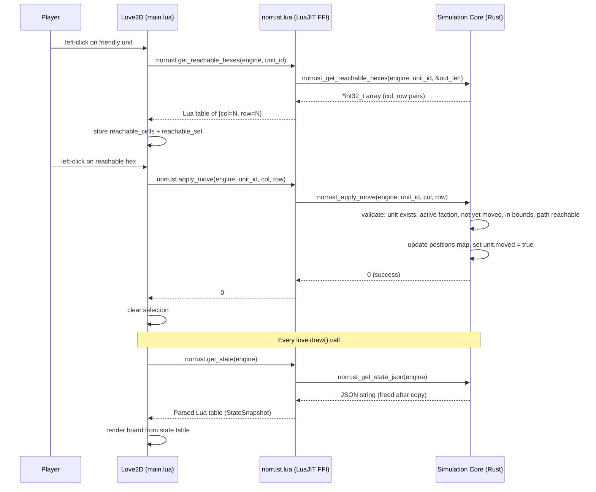
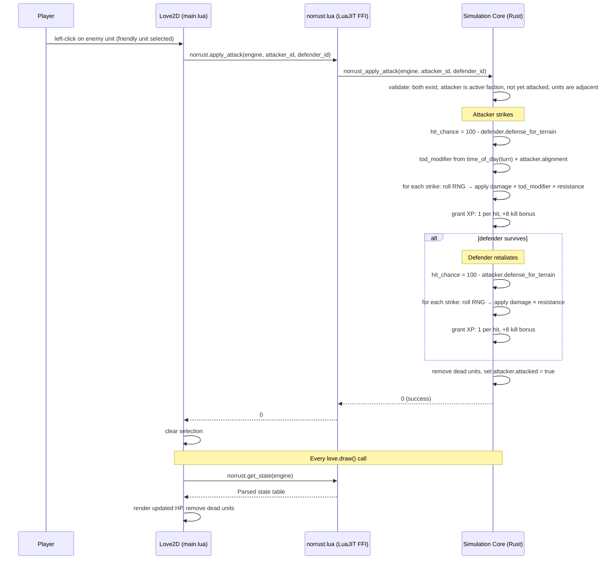

# NorRust Architecture

NorRust is built on a strict separation of concerns: the headless simulation core owns all game rules, while the presentation layer handles visuals and input. This means game logic can be tested without Love2D, and external AI agents interact via the same interface as the human player.

## System Overview

```mermaid
graph TD
    subgraph Presentation Layer ["Presentation Layer (Love2D / Lua)"]
        UI[User Interface / HUD]
        Input[Player Input Handling]
        Renderer[Hex Grid & Unit Renderer]
        ClientAI[Lua AI Trigger]
    end

    subgraph Integration Bridge ["C ABI Bridge (LuaJIT FFI)"]
        Bridge[Rust ↔ Lua Bridge]
        JSON_State[StateSnapshot (JSON)]
        JSON_Action[ActionRequest (JSON)]
    end

    subgraph Simulation Core ["Simulation Core (Rust - Headless)"]
        State[GameState & Board]
        Logic[Game Rules & Combat Math]
        Pathfinding[A* & Reachability]
        InternalAI[Analytic AI Planner]
        Visibility[Fog of War & Vision]
        Campaign[Campaign & Progression]
    end

    subgraph Data Layer ["Data Layer (Disk)"]
        TOML_Units[(Unit Definitions .toml)]
        TOML_Terrain[(Terrain Definitions .toml)]
        TOML_Factions[(Faction Definitions .toml)]
        TOML_Scenarios[(Scenario Files .toml)]
    end

    subgraph External ["External Clients"]
        Ext_AI[Python / RL Agents]
    end

    %% Flow of control and data
    Input -->|Events| Bridge
    ClientAI -->|Triggers| Bridge
    UI -->|Queries| Bridge
    Renderer -->|Queries| Bridge

    Bridge <-->|Parses / Serializes| JSON_State
    Bridge <-->|Dispatches| JSON_Action

    JSON_Action -->|Mutates| State
    JSON_State <--|Reads| State

    Logic --> State
    Pathfinding --> State
    InternalAI --> State
    Visibility --> State
    Campaign --> State

    TOML_Units -->|Loads on Startup| Bridge
    TOML_Terrain -->|Loads on Startup| Bridge
    TOML_Factions -->|Loads on Startup| Bridge
    TOML_Scenarios -->|Loads per Game| Bridge

    Ext_AI -.->|Socket/TCP| JSON_Action
    Ext_AI -.->|Socket/TCP| JSON_State
```

## Key Architectural Patterns

1. **Strictly One-Way Data Flow:**
   `Input -> FFI Bridge -> apply_action() -> Mutate State -> JSON Snapshot -> Render`
2. **"Fail-Fast" Action Validation:**
   Actions submitted to the core are validated before execution. If an action is illegal (e.g., moving too far, attacking out of range), the core returns an `ActionError` and the state remains pristine.
3. **Headless-First Testing:**
   Because the core is independent of Love2D, complex scenarios (like a 5v5 AI battle taking 100 turns) can be simulated and verified in milliseconds via standard `cargo test`.

---

## Directory Structure

```
norrust/
├── norrust_core/           # Rust simulation core (cdylib + rlib)
│   ├── src/
│   │   ├── lib.rs          # Module declarations (18 modules)
│   │   ├── board.rs        # Board, Tile structs
│   │   ├── game_state.rs   # GameState, apply_action(), Action, ActionError
│   │   ├── hex.rs          # Hex coordinate type (cubic + odd-r offset)
│   │   ├── unit.rs         # Unit, advance_unit(), parse_alignment()
│   │   ├── combat.rs       # Combat resolution, time_of_day(), specials
│   │   ├── pathfinding.rs  # reachable_hexes(), A*, ZOC
│   │   ├── ai.rs           # ai_take_turn() greedy planner
│   │   ├── mapgen.rs       # generate_map() procedural terrain generator
│   │   ├── visibility.rs   # compute_visibility(), vision range, fog of war
│   │   ├── campaign.rs     # Campaign state, scenario progression, veteran carry-over
│   │   ├── dialogue.rs     # Dialogue trigger system (one-shot events)
│   │   ├── save.rs         # Game state serialization/deserialization
│   │   ├── schema.rs       # UnitDef, TerrainDef, AttackDef (serde)
│   │   ├── loader.rs       # Registry<T>, load_from_dir()
│   │   ├── snapshot.rs     # StateSnapshot, TileSnapshot, ActionRequest (JSON)
│   │   ├── scenario.rs     # load_board(), load_units() file I/O
│   │   └── ffi.rs          # C ABI bridge — 78 extern "C" functions
│   └── tests/
│       ├── simulation.rs   # Headless game simulation tests
│       ├── test_ffi.rs     # FFI integration test
│       ├── campaign.rs     # Campaign progression tests
│       ├── dialogue.rs     # Dialogue trigger tests
│       ├── scenario_validation.rs  # Scenario integrity tests
│       └── balance.rs      # Balance simulation tests (slow — do not run casually)
├── norrust_love/           # Love2D project (Lua frontend, 29 modules)
│   ├── main.lua            # Entry point and game loop
│   ├── norrust.lua         # LuaJIT FFI bindings + JSON decoder
│   ├── draw*.lua           # Rendering (board, HUD, sidebar, screens)
│   ├── input*.lua          # Input handling (play, deploy, setup, saves)
│   ├── save.lua            # Save/load with custom TOML serializer
│   ├── roster.lua          # UUID generation + campaign roster CRUD
│   ├── events.lua          # Event bus (decouples gameplay from UI)
│   └── ...                 # camera, combat, animation, sound, hex, state, ...
├── data/
│   ├── units/              # 112 unit TOML files across 31 advancement trees
│   ├── terrain/            # 14 terrain TOML + PNG files
│   ├── factions/           # 4 faction definitions
│   └── recruit_groups/     # Recruitable unit lists
├── scenarios/              # 7 scenario directories
├── campaigns/              # Campaign definitions
├── debug/                  # Debug sandbox config
└── tools/                  # Utility scripts (8 Python tools)
```

---

## Component Details

### 1. Presentation Layer (Love2D / Lua)
The frontend (`norrust_love/`) is entirely responsible for visuals and capturing player intent. It knows *nothing* about game rules, unit stats, or hex math beyond coordinate conversion.
- **Responsibilities:** Rendering the hex grid with terrain tiles, drawing animated unit sprites, handling mouse clicks, managing the UI HUD, sidebar panels, recruit interface, save/load screens, and campaign progression.
- **State Management:** The client holds no authoritative state. Every frame, it calls `norrust.get_state(engine)` to receive a fresh parsed StateSnapshot and renders from that data alone.
- **Action Dispatch:** When a player clicks to move or attack, the client does not execute the action. It calls a typed FFI wrapper (`norrust.apply_move`, `norrust.apply_attack`, `norrust.end_turn`) and the Rust core decides whether it is legal.
- **Fog of War:** The client tracks `fog.seen` (persists across turns) and `fog.visible` (rebuilt each frame from `get_state_json_fow`). Shroud (never seen) renders at 80% black, fog (previously seen) at 50% black.
- **Event Bus:** `events.lua` decouples gameplay from UI subscribers — dialogue, sound, animations all subscribe to events emitted by the game loop.
- **Hex Math:** Pure Lua functions (`hex_to_pixel`, `pixel_to_hex`) handle pointy-top odd-r offset coordinate conversion.

### 2. Integration Bridge (C ABI & LuaJIT FFI)
The boundary between Love2D (Lua) and Rust. This layer translates Lua calls into type-safe Rust execution.
- **C ABI:** `ffi.rs` exposes 78 `extern "C"` functions with an opaque `NorRustEngine` pointer. All functions use C-compatible types (i32, `*const c_char`, `*mut i32`).
- **LuaJIT FFI Bindings:** `norrust.lua` uses `ffi.cdef` to declare all C function signatures and wraps them with Lua-friendly return types. Strings are converted via `ffi.string()` then freed with `norrust_free_string()`. Integer arrays are read into Lua tables then freed with `norrust_free_int_array()`.
- **Memory Management:** Caller-frees pattern. Rust allocates strings/arrays with `CString::into_raw()` / `Box::into_raw()`. Lua is responsible for calling the corresponding free function. `ffi.gc` attaches `norrust_free` as a destructor on the engine pointer for automatic cleanup.
- **JSON State Serialization:** The Rust core exports the full board and unit state as a JSON string (`StateSnapshot`). An inline pure-Lua JSON decoder in `norrust.lua` parses it into native Lua tables.
- **Fog-of-War Filtering:** Two state query paths: `get_state_json` (full, cached) for AI/debug, and `get_state_json_fow` (filtered, uncached) for human players — only reveals units in visible hexes.
- **Coordinate Translation:** Lua works in offset coordinates (col, row). The bridge converts these to cubic hex coordinates via `Hex::from_offset()` at every entry point; `hex.to_offset()` converts back for outgoing data.
- **Registry Ownership:** On startup, `norrust_load_data()` reads the `data/` directory and populates `Registry<UnitDef>` and `Registry<TerrainDef>` on the engine. The simulation core itself has no registry access — unit and terrain stats are copied into runtime structs at spawn/placement time.

### 3. Simulation Core (`norrust_core`)
The authoritative brain of the game, written in pure Rust. It operates entirely headlessly and can be compiled as a standard library (`rlib`) for unit testing or as a dynamic library (`cdylib`) for loading via LuaJIT FFI.
- **GameState & Board:** `Board` stores a `HashMap<Hex, Tile>` where each `Tile` carries terrain properties (movement cost, defense, healing, color). `GameState` owns the unit registry (`HashMap<u32, Unit>`) and position map (`HashMap<u32, Hex>`) separately.
- **Game Rules:** Enforces movement costs, Zone of Control (ZOC), combat resolution (RNG, damage calculation, resistances, Time of Day modifiers, combat specials), and XP/advancement logic.
- **Pathfinding:** Implements flood-fill reachability and A* shortest-path for movement and ZOC calculations.
- **Visibility:** `compute_visibility()` calculates visible hexes for a faction based on unit vision ranges. Returns `HashSet<Hex>` used by the FOW-filtered state query.
- **Campaign:** Tracks multi-scenario progression, veteran carry-over (XP, advancement), gold inheritance, and roster management.
- **Analytic AI:** A built-in greedy AI (`ai_take_turn`) scores every possible move+attack pair using expected damage, picks the best, and calls `apply_action()` like any other client.

### 4. Data Layer (TOML)
NorRust is heavily data-driven. Hardcoding stats is strictly avoided.
- **Registry Pattern:** On startup, the bridge reads the `data/` directory and loads all `.toml` files into a generic `Registry<T>`, keyed by the item's `id` field.
- **Unit Definitions:** Stats for all 112 units (HP, movement, attacks, resistances, alignment, advancement chains) are defined here. When a unit is spawned via `place_unit_at()`, it copies its properties from the registry into a standalone `Unit` struct.
- **Terrain Definitions:** Each terrain type (defense, movement cost, healing, color) is defined here. When a tile is placed via `set_terrain_at()` or `generate_map()`, a `Tile` struct is initialised from the matching `TerrainDef`.
- **Faction Definitions:** Each faction specifies a leader unit type, recruit groups, and starting gold. Four factions: Loyalists, Rebels, Northerners, Undead.

---

## Sequence Diagrams

### Player Move



### Combat Resolution


